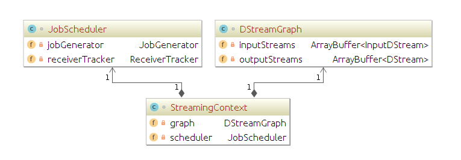
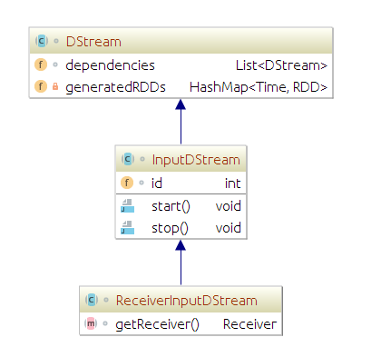

Spark Streaming是现在实时消息处理的解决方案之一，本文是简单介绍一下Spark Streaming的任务是如何执行的。
默认读者知道什么是RDD,以及SparkContext是如何提交RDD任务的。


首先，我们先看一个Spark Streaming程序的例子(取自Spark Streaming Example,删除了部分无关代码和注释)
```scala
object NetworkWordCount {
  def main(args: Array[String]) {
    // 通过指定的host和ip，以socket的形式读取每一行数据，以1秒为批次，计算每批数据的word count并打印
  
    val host = args(0)
    val port = args(1).toInt

    val sparkConf = new SparkConf().setAppName("NetworkWordCount")
    val ssc = new StreamingContext(sparkConf, Seconds(1))

    val lines = ssc.socketTextStream(host, port, StorageLevel.MEMORY_AND_DISK_SER)
    val words = lines.flatMap(_.split(" "))
    val wordCounts = words.map(x => (x, 1)).reduceByKey(_ + _)
    wordCounts.print()
    ssc.start()
    ssc.awaitTermination()
  }
}
```
我们可以看到，整个Spark Streaming的入口是StreamingContext这个类。
下图为StreamingContext这个类中比较重要的两个对象。   


其中，DStreamGraph会持有该StreamingContext的所有输入流，以及输出流。
JobScheduler则分别通过ReceiverTracker来管理所有的Receiver以及处理Receiver接收的数据；
通过JobGenerator定时生成每个批次的RDD任务，提交给Executor执行。

这里我们引入了几个新的类DStream, InputDStream, Receiver。
  
DStream是Spark对RDD在时间维度上的一个封装，代表了一个RDD的流。
(主要是为了在Spark工作栈方面的统一，但也正因为这个问题，Spark Streaming暂时不支持实时消息处理)
如果Spark Core的处理方式是RDD组成的DAG, 那么Spark Streaming就是DStream组成的DAG(Streaming中没有明确的DAG概念)。
DStream的dependencies对象的作用和RDD的deps类似，都是为了把这个图描述出来。
DStream的generatedRDDs对象是用于保存时间戳和RDD的映射关系，也就是上面提到的DStream是一个RDD的流。
这个时间戳就和我们初始化StreamingContext时的batchDuration参数有关。而对应的RDD可以理解为这段时间内的数据。
其实我们对Streaming的操作最后都会映射到对这个对应的RDD进行操作。
插句题外话，我们去翻看WindowedDStream的compute方法的话，会发现他是对一段时间内的RDD做了一个union操作,把它们当做同一个RDD来看待。

那么，相对于RDD具备transform和action, DStream呢？
DStream有一种叫output operator的操作，核心是调用了foreachRDD()这个方法。(print, saveAsxxx也都是间接使用了这个方法)
而在foreachRDD()起到关键性作用的就是，它会调用register()方法(当然先转化为ForEachDStream)，这个方法会把我们最终的DStream加入到StreamingContext对象
的graph(DStreamGraph)的outputStreams中。这样，我们一个Stream的图(类似于RDD的DAG)就组装完成了。

拼图的工作暂时告一段落。我们来看一下DStream的子类，一部分是通过内部操作生成的子类例如MappedDStream，FilteredDStream等，另一部分是
InputDStream也就是我们所处理的数据的数据源的抽象类。
```scala
abstract class InputDStream[T: ClassTag](_ssc: StreamingContext)
  extends DStream[T](_ssc) {

  ssc.graph.addInputStream(this)

  /** This is an unique identifier for the input stream. */
  val id = ssc.getNewInputStreamId()
```  
这个抽象类里面，我们关注两个点:
1. 类对象初始化时，会自动把该对象加入到StreamingContext对象的graph(DStreamGraph)的inputStreams中。
2. 每个对象都有从StreamingContext拿到的唯一id。

关于InputDStream的子类又分为两种：
从Driver端接收数据的话，直接继承InputDStream即可。
需要分布式接收数据的话，则需要继承InputDStream的子类ReceiverInputDStream。

Driver端接收数据的方式我们这次不研究。主要看ReceiverInputDStream。
有些同学可能已经猜到，Spark Streaming是对不同数据源进行Receiver类的具体实现、ReceiverInputDStream类的具体实现来统一接收数据的。

这里，对于不同数据源的不同实现我们不做解读。我们主要来看一下这些Receiver都是怎么运作的。

退回到最初的例子。
1. 初始化StreamingContext
2. 从StreamingContenxt拿到ReceiverInputDStream的子类SocketInputDStream
3. 进过各种DStream的转化，最终调用print()方法（内部调用foreachRDD()），把最终的ForEachDStream，并把该DStream加入到graph的outputStreams中。
4. 调用StreamingContext的start()方法，触发整个逻辑的执行。

那么在StreamingContext的start()方法做了什么呢？
主要逻辑在一个叫streaming-start的线程中，只有一行代码
```scala
scheduler.start()
```  
这个对象在我们第一个图里是有体现的。类型是JobScheduler。
我们进入JobScheduler的start()方法看一下。
有以下几个动作：
1. 初始化内部消息队列eventLoop
2. 初始化并启动receiverTracker
3. 启动jobGenerator
4. 初始化并启动executorAllocationManager

我们重点关注一下在第一个图中有体现的receiverTracker和jobGenerator

ReceiverTracker的start()方法
1. 注册一个RPC endpoint对象用于RPC通信
2. 调用launchReceivers()方法

launchReceivers()方法做了什么呢？
```scala
private def launchReceivers(): Unit = {
    // 拿到graph中inputDStreams里面所有是ReceiverInputDStream子类的对象
    val receivers = receiverInputStreams.map { nis =>
      // 对这些对象调用getReceiver()方法，拿到对应的Receiver对象，并把上文的InputDStream的id塞给对应的receiver。
      val rcvr = nis.getReceiver()
      rcvr.setReceiverId(nis.id)
      rcvr
    }
    // 调用runDummySparkJob()方法，该方法是为了保证所有的slave节点都已经注册，防止所有的receiver任务都发布在同一个节点。
    runDummySparkJob()

    logInfo("Starting " + receivers.length + " receivers")
    // 通过RPC endpoint对象发送StartAllReceivers消息。
    endpoint.send(StartAllReceivers(receivers))
  }

```


StartAllReceivers消息传到哪了？怎么处理？
翻到ReceiverTrackerEndpoint的receive()方法
```scala
override def receive: PartialFunction[Any, Unit] = {
      // Local messages
      case StartAllReceivers(receivers) =>
        // 根据receivers和executors的信息，分配receivers应该分发到哪些节点处理。
        // 主要原则是如果receiver对象重写了preferredLocation方法，就按该方法进行分配。
        // 否则就尽量分散分配。
        val scheduledLocations = schedulingPolicy.scheduleReceivers(receivers, getExecutors)
        for (receiver <- receivers) {
          // 拿到上面处理好的executor对象
          val executors = scheduledLocations(receiver.streamId)
          // 更新内部的receiver和executor对应关系表(hashMap)
          updateReceiverScheduledExecutors(receiver.streamId, executors)
          // 更新内部的receiver preferedLocations对象(hashMap)
          receiverPreferredLocations(receiver.streamId) = receiver.preferredLocation
          // 发布receiver任务
          startReceiver(receiver, executors)
        }
        
        ...
        
        }
```

startReceiver方法的内容我精简一下,并适当调换顺序
```scala
private def startReceiver(
        receiver: Receiver[_],
        scheduledLocations: Seq[TaskLocation]): Unit = {
      
      // 我们自己构造一个RDD,内容是receiver和执行的executor的对应关系
      val receiverRDD: RDD[Receiver[_]] ={
          val preferredLocations = scheduledLocations.map(_.toString).distinct
          ssc.sc.makeRDD(Seq(receiver -> preferredLocations))
        }
      
      val checkpointDirOption = Option(ssc.checkpointDir)
      val serializableHadoopConf =
        new SerializableConfiguration(ssc.sparkContext.hadoopConfiguration)

      // 构造一个方法，主要内容是如何让receiver在worker上执行。
      val startReceiverFunc: Iterator[Receiver[_]] => Unit =
        (iterator: Iterator[Receiver[_]]) => {
            val receiver = iterator.next()
            // 初始化ReceiverSupervisorImpl的对象，把我们的receiver作为构造参数传入。
            val supervisor = new ReceiverSupervisorImpl(
              receiver, SparkEnv.get, serializableHadoopConf.value, checkpointDirOption)
            // 调用该对象的start()方法
            supervisor.start()
            supervisor.awaitTermination()
        }

      // 以提交rdd任务的形式，对上述rdd执行我们构造的startReceiverFunc方法。
      val future = ssc.sparkContext.submitJob[Receiver[_], Unit, Unit](
        receiverRDD, startReceiverFunc, Seq(0), (_, _) => Unit, ())
    }

```

ReceiverSupervisorImpl具体内容，我们因为篇幅有限，暂不扩展。有兴趣的同学可以自己去研究。
主要是怎么定时把接收到的数据存为Spark的Block，并告知blockManager。当然还有WAL的逻辑。

所以为什么我们要在申请资源的时候，给receiver预留资源。
这里我们就找到了答案：receiver其实是被当做rdd的job发到executor去执行的。

到这里，我们的ReceiverTracker也就告一段落了。

接下来是jobGenerator
JobGenerator的start()方法
1. 初始化内部消息队列eventLoop
2. 调用startFirstTime()方法

我们看一下startFirstTime方法的内容，非常简单
```scala
private def startFirstTime() {
    val startTime = new Time(timer.getStartTime())
    // 调用ssc.graph的start方法，主要是调用graph中每个inputDStreams对象的start()方法
    // 目前除了0.10的DirectKafkaInputDStream，其他子类都是空实现，所以我们不去研究。
    graph.start(startTime - graph.batchDuration)
    // 启动一个定时触发器，主要是每间隔batchDuration就往自身的消息队列里面发一条GenerateJobs消息。
    timer.start(startTime.milliseconds)
    logInfo("Started JobGenerator at " + startTime)
  }
```
timer定时发送的消息的逻辑如下：
```scala
private val timer = new RecurringTimer(clock, ssc.graph.batchDuration.milliseconds,
    longTime => eventLoop.post(GenerateJobs(new Time(longTime))), "JobGenerator")
```
我们关注一下定时消息GenerateJobs(new Time(longTime))的后续处理。
我这里把非核心逻辑的代码剔除掉。
```scala
  private def generateJobs(time: Time) {
    Try {
      // 通过我们前面提到的receiverTracker关联batchTime和block信息，这里不展开里面的内容。
      jobScheduler.receiverTracker.allocateBlocksToBatch(time) 
      // 对graph的outputDStreams中每个对象调用generateJob方法，组成一个Job数组(Seq)
      graph.generateJobs(time) 
    } match {
      case Success(jobs) =>
        val streamIdToInputInfos = jobScheduler.inputInfoTracker.getInfo(time)
        // 这里提交任务
        jobScheduler.submitJobSet(JobSet(time, jobs, streamIdToInputInfos))
    }
  }
```
这里会把任务封装为JobSet,然后调用jobScheduler.submitJobSet()方法。我们看一下这个方法的核心调用
```scala
def submitJobSet(jobSet: JobSet) {
    // jobExecutor是一个线程池，pool的大小通过spark.streaming.concurrentJobs确定，默认为1
    jobSet.jobs.foreach(job => jobExecutor.execute(new JobHandler(job)))
  }
```

我们看一下JobHandler的run方法
同样把非核心逻辑剔除
```scala
def run() {
    // 避免JobScheduler调用stop(false)方法时把eventLoop置位null导致空指针异常。
    var _eventLoop = eventLoop
    if (_eventLoop != null) {
      // 处理各种通知
      _eventLoop.post(JobStarted(job, clock.getTimeMillis()))
      // Disable checks for existing output directories in jobs launched by the streaming
      // scheduler, since we may need to write output to an existing directory during checkpoint
      // recovery; see SPARK-4835 for more details.
      SparkHadoopWriterUtils.disableOutputSpecValidation.withValue(true) {
        // 主要调用在此
        job.run()
      }
      _eventLoop = eventLoop
      if (_eventLoop != null) {
        // 处理各种通知
        _eventLoop.post(JobCompleted(job, clock.getTimeMillis()))
      }
    }
}
```
这里主要是调用了job的run()方法，而run()方法是调用我们初始化Job是传入的第二个构造参数func，所以我们返回到这个job生成的地方。
也就是graph.generateJobs(time)这里。
删去非核心逻辑
```scala
def generateJobs(time: Time): Seq[Job] = {
    val jobs = this.synchronized {
      outputStreams.flatMap { outputStream =>
        val jobOption = outputStream.generateJob(time)
        jobOption
      }
    }
    jobs
  }
```
我们的job是对graph的outputDStreams中每个对象调用generateJob()方法得来的。
这里要明确一点，目前版本为止，我们的这个outputDStreams只能是ForEachDStream这个类的实例，
具体原因参见上面output operator部分的register()方法。
所以我们要看ForEachDStream的generateJob()方法的实现。
```scala
private[streaming]
class ForEachDStream[T: ClassTag] (
    parent: DStream[T],
    foreachFunc: (RDD[T], Time) => Unit,
    displayInnerRDDOps: Boolean
  ) extends DStream[Unit](parent.ssc) {

  override def dependencies: List[DStream[_]] = List(parent)

  override def slideDuration: Duration = parent.slideDuration

  override def compute(validTime: Time): Option[RDD[Unit]] = None

  override def generateJob(time: Time): Option[Job] = {
    parent.getOrCompute(time) match {
      case Some(rdd) =>
        val jobFunc = () => createRDDWithLocalProperties(time, displayInnerRDDOps) {
          foreachFunc(rdd, time)
        }
        Some(new Job(time, jobFunc))
      case None => None
    }
  }
}
```

这里似乎卡主了，因为目前是看不到任何通过sparkContext提交RDD任务的逻辑。
不过，再次看一下我们的例子。
我们在例子最后，调用了DStream的print()方法。这个output operator，我们看一下这个方法的逻辑。
```scala
def print(num: Int): Unit = ssc.withScope {
    def foreachFunc: (RDD[T], Time) => Unit = {
      (rdd: RDD[T], time: Time) => {
        val firstNum = rdd.take(num + 1)
        // scalastyle:off println
        println("-------------------------------------------")
        println(s"Time: $time")
        println("-------------------------------------------")
        firstNum.take(num).foreach(println)
        if (firstNum.length > num) println("...")
        println()
        // scalastyle:on println
      }
    }
    foreachRDD(context.sparkContext.clean(foreachFunc), displayInnerRDDOps = false)
  }
```
**val firstNum = rdd.take(num + 1)**这里调用了rdd的take()方法，而take()方法是一个rdd的action操作(action操作会调用sparkContext的runJob()方法提交rdd任务到集群)。
这端代码经过两个函数的包装：
1. 包装为foreachFunc，传给ForEachDStream的构造参数。
2. 在ForEachDStream的generateJob()方法中，包装为jobFunc传给Job类的第二个构造方法。
所以我们的DStream中的output operator是会转化为RDD任务提交到集群处理。

这里，我们的主要流程就走完了。
回顾主要两点内容：
1. Receiver会作为RDD任务提交到集群执行。
2. DStream最终的执行形式也是转化为RDD任务进行提交。